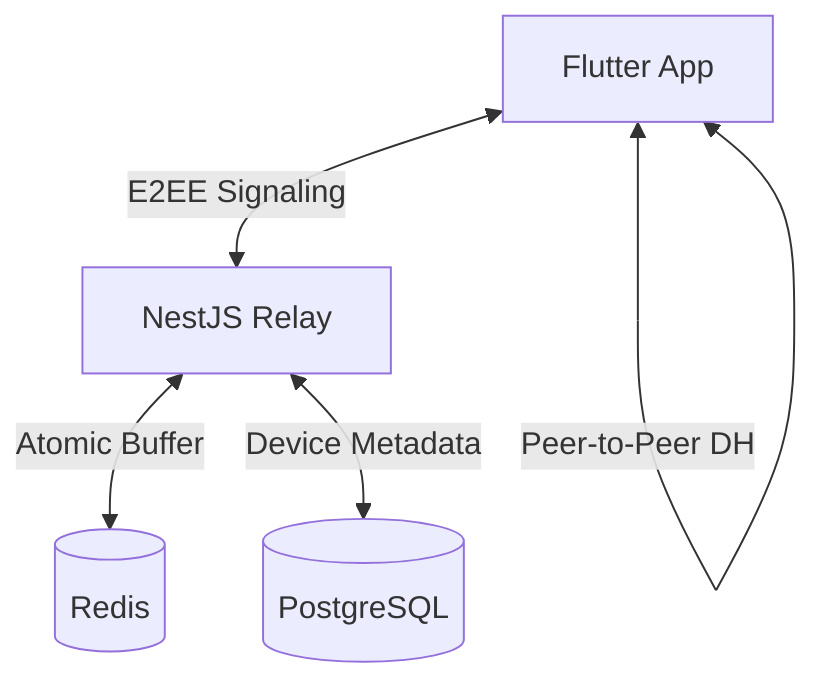

# Privora Secure (1-Tap)
### Industry-Grade Zero-Retention Communication Platform

Privora Secure is a privacy-first, zero-knowledge communication infrastructure designed for high-security ephemeral messaging. It achieves absolute confidentiality by ensuring that the relay server is mathematically incapable of reading or permanently storing any message content.

---

## 🔐 Core Security Principles
*   **End-to-End Encryption (E2EE)**: All keys are generated and stored locally in the device's secure enclave. Plaintext never leaves the client.
*   **Zero-Knowledge Backend**: The server acts as a blind relay, storing only transient ciphertexts in an atomic ephemeral buffer.
*   **Atomic Purging**: Messages are self-destructing. Once a recipient reads a message, it is instantly purged from both memory and disk using atomic Redis operations.
*   **Device-Bound Trust**: No password-only accounts. Identity is anchored to cryptographic device keys (Ed25519).

## 🚀 Technology Stack
*   **Mobile Client**: Flutter (Dart) with Clean Architecture & Riverpod Notifier state management.
*   **Relay Backend**: NestJS (TypeScript) utilizing a High-Concurrency WebSocket Gateway.
*   **Persistence Layer**: PostgreSQL (User/Device metadata via Prisma 7).
*   **Ephemeral Layer**: Redis (Atomic message buffering with 24h fallback TTL).
*   **Cryptography**: X25519 (Key Exchange), Ed25519 (Signatures), AES-256-GCM (Payload Encryption).

---

## 🏛️ System Architecture


## 🛠️ Getting Started

### 1. Infrastructure (Docker)
Ensure Docker Desktop is running, then launch the database and cache services:
```bash
docker-compose up -d
```

### 2. Backend Setup (NestJS)
```bash
cd apps/backend
npm install
npx prisma generate
npx prisma db push
npm run start:dev
```

### 3. Mobile Client (Flutter)
Ensure an Android emulator (Pixel 6 recommended) is running:
```bash
cd apps/mobile
flutter pub get
flutter run
```

---

## 🧪 Cryptographic Protocol
1.  **Identity**: Device generates an **Ed25519** keypair for signing and an **X25519** keypair for key exchange.
2.  **Negotiation**: Alice fetches Bob’s public X25519 key and derives a shared secret via **Diffie-Hellman**.
3.  **Transmission**: Alice encrypts the payload with **AES-256-GCM** and signs it.
4.  **Relay**: The backend receives the ciphertext, stores it in Redis with a 24h TTL, and notifies Bob via WebSockets.
5.  **Destruction**: Bob retrieves the message; the backend deletes the record **atomically** before Bob even starts decryption.

---

## 📈 Industry Compliance
- **Input Validation**: Strictly enforced via DTOs and ValidationPipes.
- **Data Privacy**: GDPR/CPRA ready (no permanent storage of personal communications).
- **Hardened**: No `any` types in mission-critical cryptographic paths.

---
*Created with ❤️ by the Privora Secure Development Team.*
